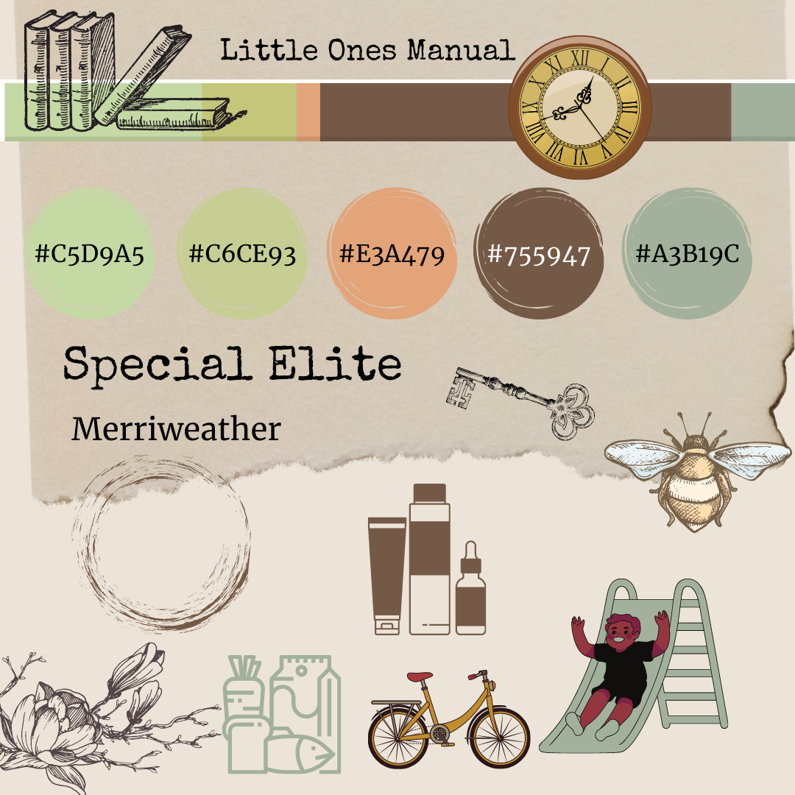
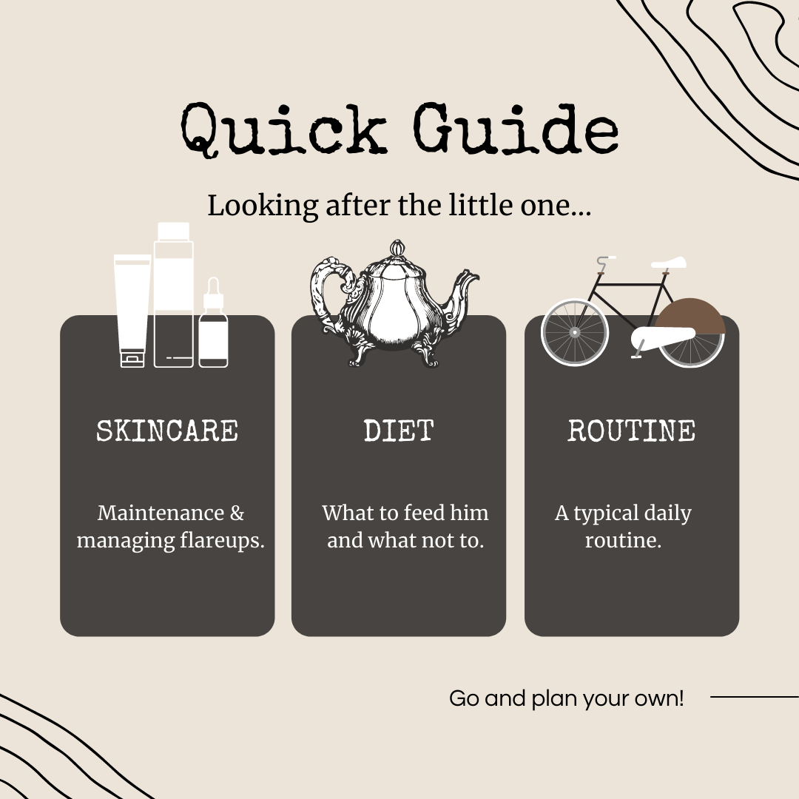
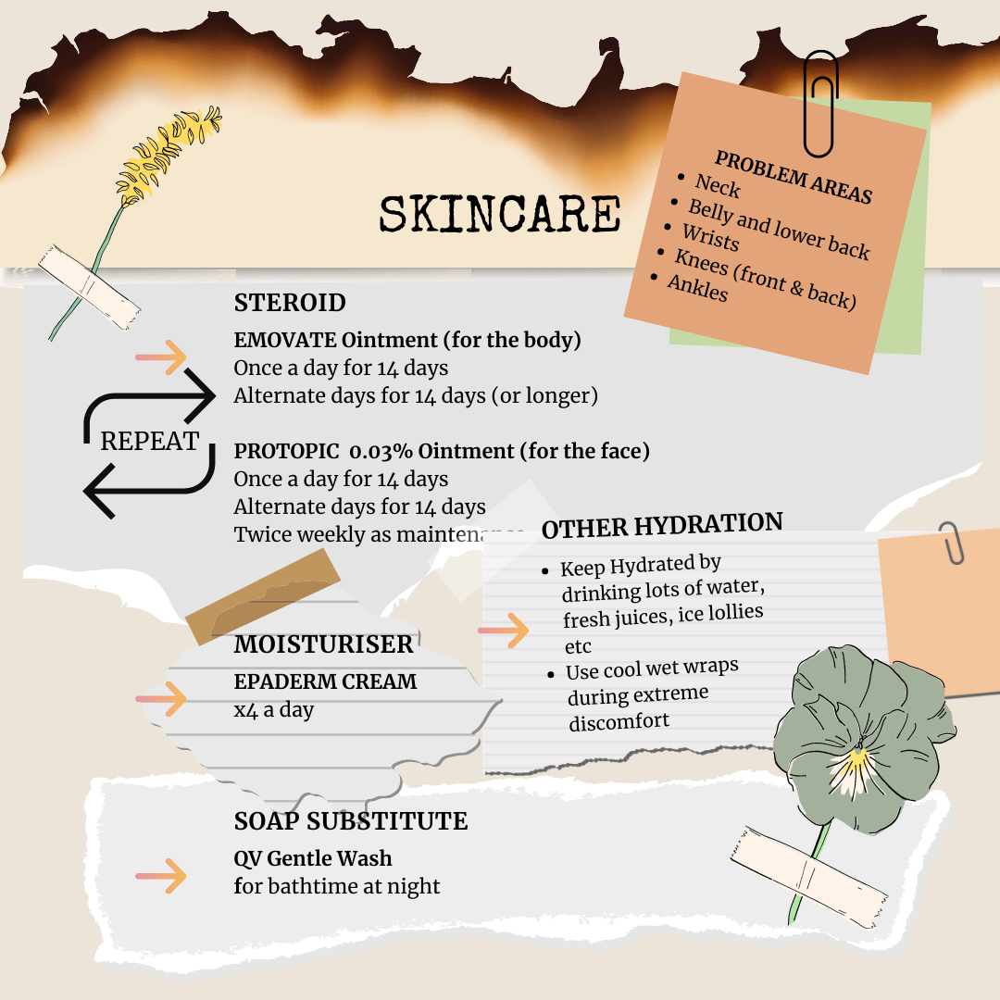

 # **Little Ones Manual**

## **Goal for this project**

Have you ever been nervous about handing your child over to someone to look after especially when your child has
medical needs and suffers from severe allergies and skin conditions?

Are you getting lots of phone calls and messages about whether it's ok for your child to take part 
in certain activities or eat certain foods?

What if your child has an allergic reaction and you're not around to care for them... Where and How do you 
relay all this important information?

The Little Ones Manual is an example of how to put all this information together so everyone is on the 
same page about looking after your little one. 
Instead writing down all the information about what to do on paper, text messages and phone calls
you can use the Little Ones Manual to keep it all in once place. 

Next time you get a phone call or text message, you can easily refer them to your little ones manual and 
finally be able to answer all those repetitive questions you keep getting asked!

Thank you for visiting my project!  
If you have any feedback or questions, head over to my GitHub contact details and feel free to reach out to me.

You can view the live website [HERE](https://lolaedun.github.io/lom/)

--- 

## **UX**

### **User Goals**

* The website has to work well on all kind of devices like mobile phones, tables and desktops.
* The website has to be easy to use and quick access to information
* Visually appealing website

### **User Stories**

* As a user, I would like to get information on following the daily skincare routine in order to maintain consistency.
* As a user, I would like to quickly find out what foods are safe to give the little one.
* As a user, I want to find ideas on meals I can make because of allergies.
* As a user, I would like to gain a quick understanding of how to look after severe eczema and manage flare ups.
* As a user, I want to be able to have a point of reference for anytime there is uncertainty about caring for the little one.

### **Site owners Goals**
* To have an appealing website that provides enough information to any carer looking after the little one.
* To have a great functionality so the user feels like this website helps them in maintaining consistency with the little ones routine and care. 
* To make sure everybody is on the same page so we can avoid extreme skin reactions.

## Wireframes

These wireframes were created using [Balsamiq](https://balsamiq.com/) during the Scope Plane 
part of the design and planning process for this project. I have decided to go for a 1 page website
to make it easier to access information quickly.

You can find my wireframes below:

### [Desktop Wireframe](wireframes/Desktop-LOM.png)

### [Tablet Wireframe](wireframes/Tablet-LOM.png)

### [Mobile Wireframe](wireframes/Mobile-LOM.png)

 
### Fonts

- Merriweather as the headline text and Special Elite as body text. I particularly like the vintage
typewriter look  for the body

### Icons

- coffee stains and parchment paper

### Colours Mood board and Mockups

- Vintage, Parchment paper and coffee stains look.

# Features
 
## Existing Features

### Elements on every page

#### Navigation
For the navbar I have used Boostrap to create a responsive navbar. 
There is a hamburger icon for mobile devices to make it more user-friendly. 
I have implemented the scroll spy option from bootstrap to help the user navigate easily to each section of the page. 
For this to work properly I have fixed the navbar on the top of the page.
The navigation bar features a logo on the far left, which links to the home page of the site.

#### Home Section

I have decided to add 3 main section cards with buttons which spreads over 100% width of the screen. 
The 3 buttons link to the corresponding sections on the webpage
The cards respond well when viewing on desktop, tablet and mobile.

#### Skincare Section

Here I used the grid from bootstrap to create 5 different lists to make it easier to read the 
information quickly and easily.

#### Safe Foods Section

Here I also worked with the grid from bootstrap to create a different set of lists which interact
with the user when hovering over the food items. I have removed the effect on hover that gives
the user the impression that it's clickable in order to avoid confusion. I have also styled
the food groups into different colours to make it easier to quickly identify them.

#### Sample Meal Plan Section

I have purposely left this background colour the same as the safe foods section to demonstrate
they both fall under the diet part of the webpage. This makes the information more easy to understand.
Initially there was a hover effect on the meal plan but this has been taken out as it became
an unneccessary distraction for the user. The striped rows on their own make the meal plan
more legible and quick to grasp the information.

#### Sample Routine Section

Here I have used flexbox from bootstrap to create the 3 sections so they are mobile responsive.

### Features Left to Implement
- search bar 
- contact form
- downloadable allergy tests
- users to easily contribute to and update content

## Technologies Used

- [Git](https://gist.github.com/derhuerst/1b15ff4652a867391f03) to handle version control.
- [GitHub](https://github.com/) to store and share all project code remotely.
- [Imgbb](https://imgbb.com) to store external images for this project that were not entered into the database.
- [Balsamiq](https://balsamiq.com/) to create the wireframes for this project.
- [Google Docs](https://docs.google.com//) excel to create sample tables with data.

### Libraries

- [Bootstrap](https://www.bootstrapcdn.com/) to simplify the structure of the website and make the website responsive easily.
- [FontAwesome](https://www.bootstrapcdn.com/fontawesome/) to provide icons for the website.
- [Google Fonts](https://fonts.google.com/) to style the website fonts.
- [Canva](https://www.canva.com/) to design elements for the website.

### Languages
- This project uses HTML, CSS and JavaScript programming languages.

## **Testing**

### **Accessing Information Quickly**

#### User story: As a user, I would like to get information on following the daily skincare routine in order to maintain consistency.
* **Plan**  
My plan is to create a skincare section that highlights the problem areas to look for as well as daily routines for 
maintenance and managing flare ups.

* **Implementation**  

I added a nav bar with scroll spy to quickly move to various sections.
I also added 3 main cards with buttons on the top section of home page which provide the same function.
I added a image background to distinguish this section from the others and grouped the treatments and daily care into
different list groups with short notes for extra information.

* **Test**
I clicked on the skincare "lets go" button on the home page and it scrolls down to the correct section.
I noticed it wasn't always clear where the user was on the nav bar, so I added a highlight to display the active 
menu section. This helps the user understand where they are in the site.
I clicked on the skincare menu item in the nav bar and it scrolls down to the correct section.

* **Result**

Skincare section is displaying as planned and the links work well.
Tested this section on various browsers and devices and it is reponsive and user friendly.
Adding the highlights to the nav bar menu improved the user experience.

* **Verdict**  

The test has passed all the criteria and works like planned.

#### User story: As a user, I would like to quickly find out what foods are safe to give the little one.

* **Plan**  
I want to create a section on the website that lists all the current foods that are safe for the little one to eat.
I will divide the foods into different groups to make it easy for the user to quickly read and find the information.
My first plan was to have different pages for each section but I soon realised this would make it more cumbersome for 
the user to click through each page.

Therefore after creating a one-page site the user can easily click on a button to quickly scroll down to the required sections.
This way the user can quickly get to information much faster and with ease.

* **Implementation**  

Food items are highlighted on mouse hover for User Interaction.
 

* **Test**  

I clicked on the safe foods "lets go" button and it scrolls down to the correct section.
On the nav bar I clicked on "Diet" and selected "safe foods" and it scrolls down to the correct section.

I also tested to make sure the food groups collapse and are responsive on smaller devices.

* **Result**  

Safe foods section is displaying as planned and the links work well.
Tested this section on various browsers and devices and it is reponsive and user friendly.
Adding the highlights to the foods list improved the user experience.

* **Verdict**
The test has passed all the criteria and works like planned.

## **Bugs**

### **Gap on far right of screen on mobile**

* **Bug**  
Theres a gap on the far right of the screen in mobile view. Especially visible in the skincare section.

* **Fix**       
I changed the div classes and margins on sample routine and skincare section and it seems to have removed
the gap on all smaller devices except for iphone5. For the iphone 5 I added an overflow to the html and body
tags

* **Verdict**    
No more gap on far right of screen in mobile.

### **Sample Meal Plan Not Responsive**

* **Bug**  
The supper section on sample meal plan was not being responsive

* **Fix**       
I changed the flex classes on the div and it is seems to be responding well to different screen sizes.

* **Verdict**    
Sample Meal Plan is now working as planned. 

### **Highlighted Nav Bar not working properly**

* **Bug**  
The Home button on the nav bar is not being highlighted when active

* **Fix**       
to be fixed..

* **Verdict**    
tba.

## **Deployment**

This project was deployed via GitHub by executing the following steps.
After writing the code, committing and pushing it to GitHub:

1. Navigate to the repository on github and click **Settings**.
1. From there, go to the **Source section** within the Github Pages section.
1. Select **master branch** on the dropdown menu, and click save.
1. Now the website is live on **https://lolaedun.github.io/lom/**
1. Any time commits and pushes are sent to Github, the Github Pages site should update shortly after.

To run the project locally:

1. Click the **green Clone or Download button** on the Github Repository
1. Using the **Clone with HTTPS option**, copy the link displayed.
1. Open your IDE, and ensure the Git Terminal is open.
1. Change the working directory to the location where the cloned directory is to go.
1. Use the **"git clone" command** and paste the url copied in the second step.

## Credits

### Content - Media - Inspiration

I have used the following websites to gather ideas and information for the overall content of my website: 

* [Dunderville](https://dunderville.se/)

* [Dollar Dreadful](http://www.dollardreadful.com/)

* [Sprocket House](https://web.archive.org/web/20200806005022/http://www.sprockethouse.com/)

* [Kultika](https://www.kultika.de/kartenlegen.html)

 

I have used [Canva](https://www.canva.com/) to create all my images and graphics.
I also used [ColourLovers](https://www.colourlovers.com/palettes) to find inspiration for my colour palette.

### Acknowledgements

First of all, I would like to thank my lovely mentor Simen ([Eventyret_mentor](https://github.com/Eventyret)) for guiding me throughout this project. 
He helped me to make my project a breeze to achieve. 
He gave me a lot of tips in order to improve my code and to implement some other features in order to make my website more user friendly. 

I would also like to thank my wonderful little human for inspiring me to make this website for him.

I want to thank our Slack community as well. Whenever I had a doubt, I did some research on Slack and I always found someone who has the same issue as I did. 
This helped me a lot to get to the solution sooner. 

 