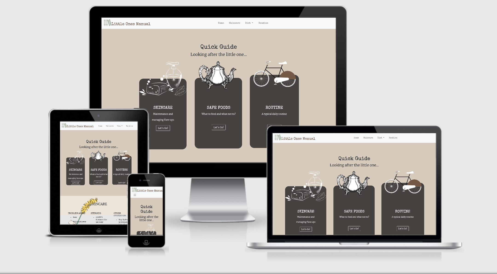

 # **Little Ones Manual**

## **Goal for this project**

Have you ever been nervous about handing your child over to someone to look after especially when your child has
medical needs and suffers from severe allergies and skin conditions?

Are you getting lots of phone calls and messages about whether it's ok for your child to take part 
in certain activities or eat certain foods?

What if your child has an allergic reaction and you're not around to care for them... Where and How do you 
relay all this important information?

The Little Ones Manual is an example of how to put all this information together so everyone is on the 
same page about looking after your little one. 
Instead writing down all the information about what to do on paper, text messages and phone calls
you can use the Little Ones Manual to keep it all in once place. 

Next time you get a phone call or text message, you can easily refer them to your little ones manual and 
finally be able to answer all those repetitive questions you keep getting asked!

Thank you for visiting my project!  
If you have any feedback or questions, head over to my GitHub contact details and feel free to reach out to me.

You can view the live website here: https://lolaedun.github.io/lom/

--- 

## **UX**

### **User Goals**

* The website has to work well on all kind of devices like mobile phones, tables and desktops.
* The website has to be easy to use and quick access to information
* Visually appealing website

### **User Stories**

* As a user, I would like to find out if it's ok to give the little one a certain food item.
* As a user, I want to find ideas on meals I can make because of allergies.
* As a user, I would like to follow the daily routine to maintain consistency.
* As a user, I would like to gain a quick understanding of how to look after severe eczema and manage flare ups.
* As a user, I want to be able to have a point of reference for anytime there is uncertainty about caring for the little one.

### Creators Goals

The Goals of the creator are:
- Provide enough information to whoever is looking after the little one to feel confident 
in his care.
- Create consistency in his routine and care.
- Feel a sense of reassurance that the little one is being looked after in a way
that feels reassuring to both the little one and his primary carer.

## User Stories

As a visitor to The Little Ones Manual website I expect/want/need:

1. To easily find what I am looking for, I want the layout of the site to 
be easy to navigate to the information I need.

1. To search for what I am unsure about in the search bar using keywords.

## Wireframes

These wireframes were created using [Balsamiq](https://balsamiq.com/) during the Scope Plane 
part of the design and planning process for this project. 

    

    

    

    

    

    

  

### Fonts

- Merriweather as the headline text and Special Elite as body text. I particularly like the vintage
typewriter look  for the body

### Icons

- coffee stains and parchment paper

### Colours Mood board and Mockups

- Vintage, Parchment paper and coffee stains look.

    

    

    

    

    

    

# Features
 
## Existing Features

### Elements on every page

#### Navbar:

- The navigation bar features a logo on the far left, which links to the home page of the site.

#### Footer

info to be added at a later stage

### Home Page

info to be added at a later stage

### Features Left to Implement
- Another feature idea

## Technologies Used

- [Git](https://gist.github.com/derhuerst/1b15ff4652a867391f03) to handle version control.
- [GitHub](https://github.com/) to store and share all project code remotely.
- [Imgbb](https://imgbb.com) to store external images for this project that were not entered into the database.
- [Balsamiq](https://balsamiq.com/) to create the wireframes for this project.
- [Google Docs](https://docs.google.com//) excel to create sample tables with data.

### Libraries

- [Bootstrap](https://www.bootstrapcdn.com/) to simplify the structure of the website and make the website responsive easily.
- [FontAwesome](https://www.bootstrapcdn.com/fontawesome/) to provide icons for the website.
- [Google Fonts](https://fonts.google.com/) to style the website fonts.
- [Canva](https://www.canva.com/) to design elements for the website.

### Languages
- This project uses HTML, CSS and JavaScript programming languages.

## Testing

In this section, you need to convince the assessor that you have conducted enough testing to legitimately believe that the site works well. Essentially, in this part you will want to go over all of your user stories from the UX section and ensure that they all work as intended, with the project providing an easy and straightforward way for the users to achieve their goals.

Whenever it is feasible, prefer to automate your tests, and if you've done so, provide a brief explanation of your approach, link to the test file(s) and explain how to run them.

For any scenarios that have not been automated, test the user stories manually and provide as much detail as is relevant. A particularly useful form for describing your testing process is via scenarios, such as:

1. Contact form:
    1. Go to the "Contact Us" page
    2. Try to submit the empty form and verify that an error message about the required fields appears
    3. Try to submit the form with an invalid email address and verify that a relevant error message appears
    4. Try to submit the form with all inputs valid and verify that a success message appears.

In addition, you should mention in this section how your project looks and works on different browsers and screen sizes.

You should also mention in this section any interesting bugs or problems you discovered during your testing, even if you haven't addressed them yet.

If this section grows too long, you may want to split it off into a separate file and link to it from here.

## Deployment

This section should describe the process you went through to deploy the project to a hosting platform (e.g. GitHub Pages or Heroku).

In particular, you should provide all details of the differences between the deployed version and the development version, if any, including:
- Different values for environment variables (Heroku Config Vars)?
- Different configuration files?
- Separate git branch?

In addition, if it is not obvious, you should also describe how to run your code locally.

## Credits

### Content
- The text for section Y was copied from the [Wikipedia article Z](https://en.wikipedia.org/wiki/Z)

insipiring websites
 https://dunderville.se/
 http://www.dollardreadful.com/
 https://web.archive.org/web/20200806005022/http://www.sprockethouse.com/
 https://www.kultika.de/kartenlegen.html

### Media
- The photos used in this site were obtained from ...

### Acknowledgements

- I received inspiration for this project from X